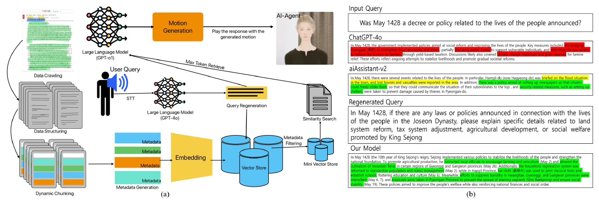
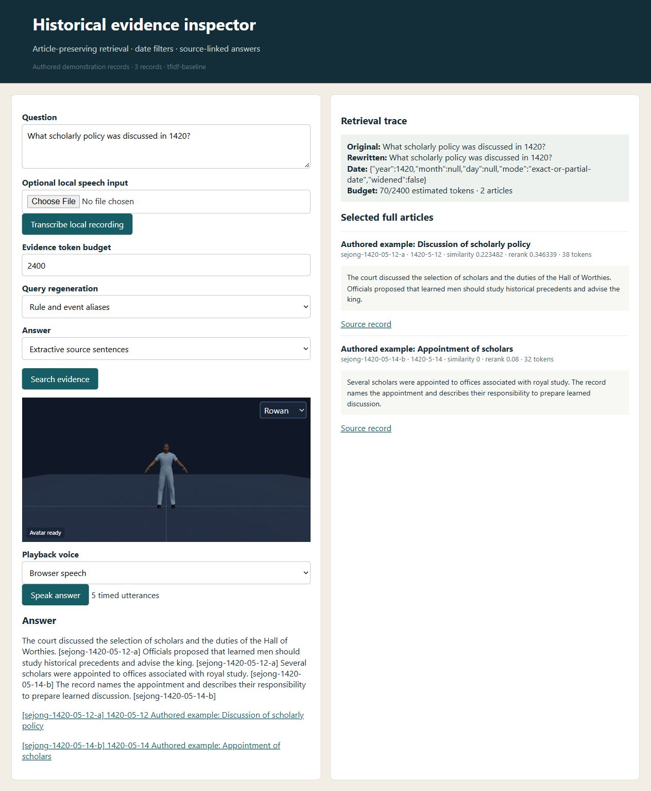

# RAG based AI-Agent for Contextualized Analysis of High-Density Historical Records: Application to the Annals of the Joseon Dynasty

**Jeongha Lee, Ghazanfar Ali, Jae-In Hwang**

**IEEE ISMAR-Adjunct · 2025** · Published

[Paper / publisher](https://doi.org/10.1109/ismar-adjunct68609.2025.00243) · [Project page](https://ghazanfarali.com/research/joseon-rag-ismar/) · [BibTeX](citation.bib) · [Requirements](REQUIREMENTS.md) · [Code & setup](#implementation-and-usage)

> An embodied agent makes historical source retrieval conversational.



*Original method figure from the paper: Figure 2, PDF page 2. Extracted for this research introduction; the diagram describes the original system, not verification of this reimplementation.*

## Why this research

Historical retrieval becomes more accessible when an embodied agent can explain its evidence conversationally. This adjunct paper connects the Annals retrieval pipeline with a speaking, animated agent.

This adjunct paper integrates a retrieval-augmented language model with a Unity-based 3D agent. Questions produce grounded historical answers delivered through synchronized voice and body motion. It is a separate publication from the related journal article.

The retrieval path shares its research lineage with the separate [historical-analysis journal paper](https://github.com/ghazanPK/joseon-rag-journal); this repo adds the embodied presentation adapter while keeping its own citation and scope.

## Method at a glance

**User question** → **Historical RAG** → **Embodied answer**

| | Research system |
|---|---|
| Input | Voice or text questions about the Annals |
| Method | Historical RAG pipeline integrated with a Unity agent |
| Output | Historical answers with voice and contextual body animation |

## Evidence and scope

Comparison on factual accuracy, reliability, and reasonableness against the paper’s GPT-4o and AI-Assistant v2 baselines

**Attribution:** These findings describe the paper or manuscript, not results obtained with this repository's code.

**Study context:** Annals corpus of 49,646,667 characters; 30 benchmark questions.

**Limitations:** A 30-question historical benchmark is limited in scope. The adjunct paper's Table 1 reports the same scores as the related journal article.

## Explore the implementation

The historical retrieval core plus timed digital-human presentation events, spoken answers without citation IDs, microphone questions and a 3D browser agent; native Unity rendering is outside this implementation.

This repository contains independently written research code. The institute's original source, datasets and trained models are not distributed. Public-data preparation, commands, assumptions and checks are documented below and in [REQUIREMENTS.md](REQUIREMENTS.md).

## Resources and citation

Read the paper through its [publisher record](https://doi.org/10.1109/ismar-adjunct68609.2025.00243). PDFs are hosted by publishers or preprint archives rather than stored in this repository.

Please cite the research paper when using its ideas; [download the BibTeX citation](citation.bib). The implementation has its own documented scope.

<!-- demo-preview:start -->
## Demo preview



*Local demo with small starter examples; the capture illustrates the interface, not a reproduced paper benchmark.*

From the repository root, using the Python environment described below:

```sh
python -m pip install -e .
python -m pip install -r scripts/requirements-demo.txt
python scripts/start_demo.py
```

Open **http://127.0.0.1:8080/**. Click **Search evidence** on the prefilled question, then **Speak answer** to play the cited answer through the avatar; source IDs are shown in the status line rather than spoken. **Record question** sends a microphone recording to the local ASR endpoint when faster-whisper is configured (see below); typed questions always work. The launcher prepares pinned Three.js modules and downloads one small official BEAT BVH/TextGrid sample on first run. It builds a nine-clip local bank and fits the Wild Pose Matching adapter under ignored `outputs/beat-library/`; later runs reuse the cache. The first run needs internet access. Original recordings, large datasets, institute assets, and pretrained gesture weights are not distributed. The launcher also builds the small authored retrieval index.

The 3D presentation uses shared Three.js avatar components and bundled fictional CC0 characters. The paper-specific algorithms and data adapters live in this repository.

The application uses `wild` retrieval for recorded co-speech motion: a current public-demo adapter; the ISMAR paper does not specify this body-motion method. The article-preserving retrieval, date filtering, citations, and timed answer events remain this application's core. The BEAT preparation and retrieval dependencies are vendored in this repository, so no sibling repository checkout is needed. See `scripts/prepare_beat_demo.py` to rebuild the ignored local bank.

<!-- demo-preview:end -->

## Implementation and usage

<!-- implementation-guide -->

This repository combines article-preserving historical retrieval with a digital-human integration artifact. In addition to cited answers and an auditable retrieval trace, it emits timed speech utterances and a portable avatar adapter demo. The utterances are citation-free text for speech, with their source IDs kept as event metadata. Questions can be typed, recorded from the microphone, or uploaded as audio.

**Citation.** Jeong Ha Lee, Ghazanfar Ali, and Jae-In Hwang. “RAG based AI-Agent for Contextualized Analysis of High-Density Historical Records: Application to the Annals of the Joseon Dynasty.” *2025 IEEE International Symposium on Mixed and Augmented Reality Adjunct (ISMAR-Adjunct)* (2025). [https://doi.org/10.1109/ISMAR-Adjunct68609.2025.00243](https://doi.org/10.1109/ISMAR-Adjunct68609.2025.00243). Status: published.

This is an independent educational implementation. It is not the institute implementation and does not ship the Annals corpus, crawler output, API credentials, embedding cache, model weights, benchmark, or the paper's original prompts. The prompts in `src/joseon_rag/core.py` (`PROMPT_PROFILES`, profile `ismar`) were written from the paper's description.

### Start the embodied evidence demo

```powershell
python -m venv .venv
.venv\Scripts\Activate.ps1
python -m pip install -e .
python scripts/prepare_viewer.py
joseon-agent build examples/articles.jsonl --out outputs/demo.index.json
joseon-agent serve outputs/demo.index.json --events examples/events.json
```

Open `http://127.0.0.1:8766` to inspect cited evidence and play a bundled fictional CC0 3D avatar. The included articles are authored interface examples, not Annals records. For an offline JSON/event check, run `python scripts/verify.py`. `outputs/verify/agent/agent-events.json` contains the engine-neutral integration contract (`paperreach.joseon.digital-human.v2`). Each utterance has citation-free `text`, its `citations`, a `section` (`facts`, `analysis` or `abstention`), estimated `start`/`duration`, and a descriptive `motion_label`. In the browser demo, body motion comes from BEAT co-speech retrieval and mouth motion from the speech renderer. The labels are metadata for other engines, not reproduced Unity animation.

### Build the Sejong Annals corpus

`joseon-agent crawl` builds the corpus locally from the official National Institute of Korean History service, [Annals of the Joseon Dynasty](https://sillok.history.go.kr/). It reads the Sejong month index, each lunar month's article list and each article page, and writes one JSONL record per article:

```powershell
joseon-agent crawl --out data/sejong.jsonl --cache data/sillok-cache --years 2 --max-articles 20
joseon-agent crawl --out data/sejong.jsonl --cache data/sillok-cache            # full reign; rerun to resume
joseon-agent build data/sejong.jsonl --out outputs/sejong.index.json
```

- **Politeness.** Requests are at least 1 s apart (default 1.5 s). The crawler re-reads `robots.txt` on every run and stops on HTTP 401/403 or persistent 429/5xx responses.
- **Resuming.** Every page is cached under `--cache`. Reruns skip article IDs already written. `--offline` parses only the cache.
- **Scale.** The index lists 391 lunar months, and the paper reports 30,949 Sejong articles, so a full crawl takes at least 13 hours.
- **Dates.** Dates stay lunar. `year` is the printed Western year (세종 N년 = 1418 + N; 즉위년 = 1418), and `month`/`day` are the lunar month and day. `leap_month` and the page's own date line (`date_original`) are kept. `--include-hanja` adds the classical-Chinese original.
- **Terms.** On 6 October 2026 `robots.txt` returned an HTML not-found page with no crawl directives. The Korean translation is marked "ⓒ 세종대왕기념사업회" and the original text carries a KOGL (공공누리) mark. Follow the site's current terms, keep data under ignored `data/`, and do not redistribute it.

The parser was checked on 6 October 2026 against the live month index, one article list and three article pages. Tests use authored fixtures with the same markup.

Other sources can use the same contract, one article per JSONL (or CSV) row: `{"id","date":"YYYY-MM-DD","title","text","source_url","volume"}`. `year`/`month`/`day` may replace `date`. Then run `joseon-agent ask outputs/sejong.index.json "your question" --events examples/events.json --out outputs/my-answer.json --agent-out outputs/my-agent`. The verify script uses the same loader, retrieval, answer, citation, and digital-human adapter paths.

### Retrieval and generation

- **Lexical default.** The default TF-IDF index tokenizes Hangul and Hanja as character bigrams, so particles such as 의 do not block a match.
- **Dense option.** `--backend sentence-transformer --model path-or-cached-model-name` needs `pip install -e ".[semantic]"`; use a multilingual model for Korean. It loads a cache-only model once and searches one float32 numpy matrix.
- **Date filter.** The filter understands ISO, Korean, English month-name and Sejong reign-year dates. It never treats a bare number as a year, and filters ranges as ranges.
- **Similarity floor and packing.** A similarity floor (`--min-similarity`) keeps unrelated articles out. Fit-or-stop packing fills `--token-budget` with whole articles in strict rank order. Tokens are counted with `tiktoken` when installed, otherwise with a conservative Korean-aware estimate.
- **Extractive answers.** The default answer is extractive: cited objective facts, then a contextual-analysis section that only states the cited dates. It abstains (`INSUFFICIENT EVIDENCE:`) for non-existent events, for questions whose date contradicts the records (naming the records' date), or when no evidence fits.
- **Model endpoint.** `--generator endpoint --base-url http://localhost:8000/v1 --model your-model` uses the `ismar` prompt profile: short spoken sentences, cited facts, a brief contextual analysis and the same abstention rules. `--regenerator endpoint` adds event details and an approximate date when the question has none.
- **o1-compatible requests.** `--chat-style reasoning` (or `auto` with an `o1`/`o3`-style model name) sends a `developer` message without `temperature`.
- **Checking model output.** Adapter outputs are marked unverified. Check their source IDs before digital-human playback.

This baseline cannot reproduce the reported evaluation scores. It does not know whether an inferred date is historically correct, and the primary source may contain variant or conflicting accounts. Inspect citations and the trace. See [REQUIREMENTS.md](REQUIREMENTS.md) for the paper/assumption boundary.


### Browser demo and selected-page import

The CLI and local browser share the same article-preserving index and retrieval code. The bundled articles are authored demonstration text, not historical records. After installing the package:

```powershell
joseon-agent build examples/articles.jsonl --out outputs/demo.index.json
joseon-agent serve outputs/demo.index.json --events examples/events.json
```

Open http://127.0.0.1:8766 to inspect rewritten questions, date filters, selected full articles, scores, token use and cited answers. Playback speaks the timed utterances with retrieved BEAT co-speech motion alongside the evidence. Add `--base-url http://127.0.0.1:8000/v1 --model your-model` to enable model-powered rewrite and grounded generation controls; inspect model output against the source articles.

For a single public article you have selected and are permitted to use, import saved HTML or fetch that exact URL. The URL, manually supplied article ID/date, and extracted text are kept in each JSONL record. Annals article pages are read with the crawler's article-block parser. Other pages use `<article>`/`<main>` content when present and never include the page `<title>` in the text. Review the extraction before building; complex pages may include navigation or omit JavaScript-rendered text.

```powershell
joseon-agent import-html "https://sillok.history.go.kr/your-selected-article" --file data/selected-article.html --id selected-id --date 1420-05-12 --title "Article title" --out data/articles.jsonl
joseon-agent build data/articles.jsonl --out outputs/my.index.json
joseon-agent serve outputs/my.index.json --events examples/events.json
```

### 3D playback and optional local speech

The quickstart prepares pinned Three.js 0.170.0 in ignored `static/vendor/`. The browser includes two fictional CC0 characters and locally retrieved BEAT motion; no original Unity avatar or animation asset is included. Browser speech works without model downloads. For optional local Kokoro TTS and faster-whisper ASR, run `python -m pip install -e ".[speech]"`, install the English phonemizer requirements from [Kokoro's setup guide](https://github.com/hexgrad/kokoro) (including `espeak-ng` where required), then set `KOKORO_MODEL_DIR` to a local folder containing `config.json`, `kokoro-v1_0.pth`, and `voices/af_heart.pt`. Set `WHISPER_MODEL_DIR` to a local converted faster-whisper folder containing `model.bin`. **Record question** captures the microphone in the browser (MediaRecorder) and sends the recording to the local `/api/asr` endpoint; an audio file can be chosen instead. Both transcribe only when ASR is configured, and typed input remains available. The bundled Kokoro voice is English, so use browser speech for Korean answers. Utterances are spoken without their bracketed source IDs; the status line shows each utterance's sources. Timed motion is a research adapter, not recovered Unity animation.

<!-- avatar-recorded-motion:start -->
## Bundled characters and recorded public motion

The browser demos include Rowan and Mira, two new fictional GLB characters built with MPFB and MakeHuman community assets under CC0 1.0. See [avatar licensing and provenance](static/avatars/LICENSE.md). Use the character selector in the stage. The shared renderer supports body bones, ARKit facial channels, and approximate speaking motion.

Recorded motion is adapted to the characters' proportions. Palm landmarks set hand orientation; finger curl uses bounded hinge bends and preserves the character's finger spacing. Thumb-base opposition stays in the authored pose, with conservative recorded curl at the remaining joints. Distal bends are estimated from the preceding joint when fingertip landmarks are absent. Use the companion's hand close-up views to inspect the result.

The [avatar motion companion](static/recorded-motion.html) opens at `/static/recorded-motion.html` while the demo server is running. A small authored motion and face sample loads automatically; click **Play** without uploading files. It also plays locally selected BEAT motion, face, and WAV files on the bundled characters. These are presentation and data-inspection tools, separate from the paper implementation. No BEAT recording, dataset archive, or trained model is bundled. For recorded public motion, install the one preparation dependency and fetch a small official sample into ignored `outputs/beat-demo/`:

```sh
python -m pip install numpy
python scripts/beat_demo/fetch_modalities.py --speaker 1 --sequence 1_wayne_0_1_1 --include-bvh --max-bytes 25000000 --output-dir outputs/beat-demo/source
python scripts/beat_demo/prepare_bvh.py --bvh outputs/beat-demo/source/1_wayne_0_1_1.bvh --output outputs/beat-demo/sample/1_wayne_0_1_1-raw-motion.json --frames 120
python scripts/beat_demo/prepare_modalities.py --sequence 1_wayne_0_1_1 --source outputs/beat-demo/source --output outputs/beat-demo/sample --frames 120
```

Open the companion and select `outputs/beat-demo/sample/1_wayne_0_1_1-raw-motion.json`, `1_wayne_0_1_1-face.json`, and `1_wayne_0_1_1.wav`. The downloader caps each original file at 25 MB; the prepared clip contains up to 120 frames. The viewer uses local files and does not upload them. For other BEAT takes, substitute a matching official speaker and sequence ID.

If you already have OmniMo's processed 52-joint Unity humanoid data, use that normalized motion instead:

```sh
python scripts/beat_demo/prepare.py --dataset /path/to/processed/beat --speaker 1 --take 1_wayne_0_1_1 --output outputs/beat-demo/sample/1_wayne_0_1_1-motion.json --max-frames 120
```

Select the resulting `*-motion.json` in the companion. Its metadata carries the humanoid joint mapping and source-to-avatar coordinate conversion. The viewer fits source FK directions from the avatar's bind pose, following the spine explicitly at branching joints. This avoids applying incompatible source bone twist to the MPFB skin; it does not reproduce exact performer twist. The adapter supports Unity proximal/intermediate/distal finger names. Raw BVH remains a public-data alternative; do not mix the two skeleton conventions.
<!-- avatar-recorded-motion:end -->
